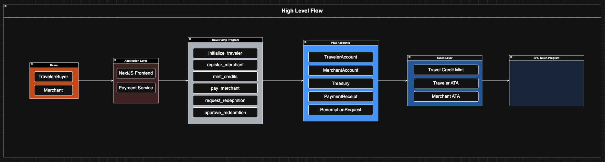
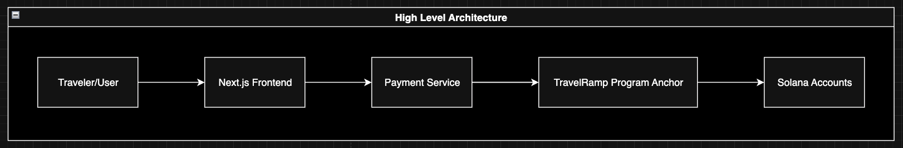
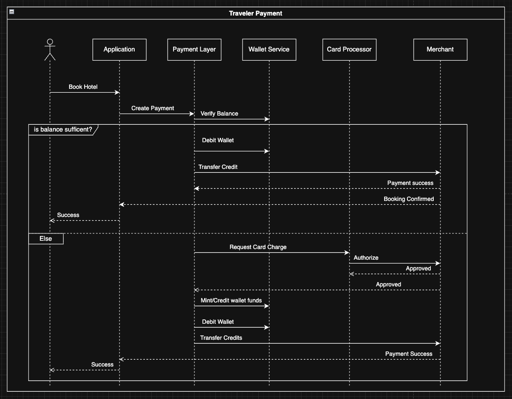
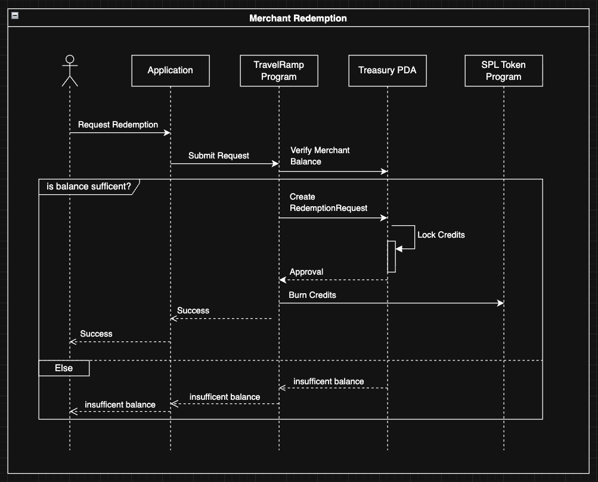

# TravelRamp Protocol Architecture

This document provides a high-level overview of the TravelRamp protocol architecture, including the main system components, account structure, and core user interaction flows.

## High-Level Flow

Shows the end-to-end flow between travelers, merchants, the application layer, and the on-chain protocol.

## High-Level Architecture

Illustrates the protocol's main components, PDAs, token accounts, external dependencies.

## Traveler Payment Sequence Diagram

Demonstrates the process of a traveler receiving credits and making a payment to a merchant.

## Merchant Redemption Sequence Diagram

Shows how merchants redeem received credits through the protocol's settlement process.

