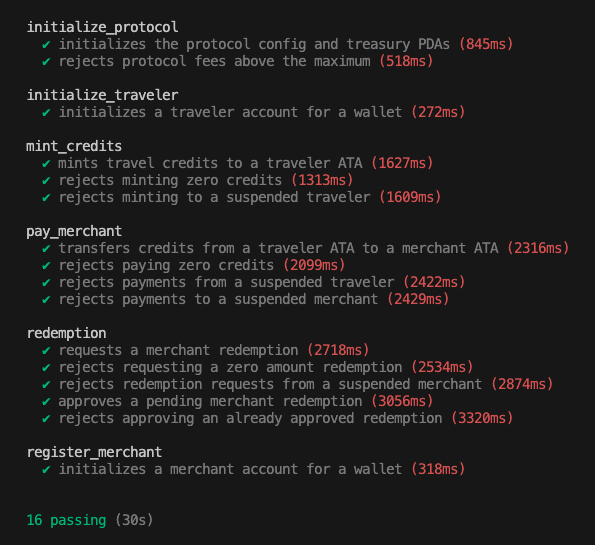

# Travel Ramp Anchor Program

Travel Ramp is an Anchor program for a custodial travel payment and merchant redemption flow on Solana.

The program manages:

- Protocol initialization with a TravelUSD mint and treasury PDA
- Traveler accounts controlled by generated custodial wallets
- Merchant accounts controlled by generated custodial wallets
- TravelUSD minting for travelers
- Traveler payments to merchants with protocol fees
- Merchant redemption requests and admin approval

## Program

Current program id:

```txt
Di6eWsPjLxVJwkZ9wJPs71PkFuxJrwieCKYa93kdfFYa
```

This id must match:

- `declare_id!` in `programs/travel-ramp/src/lib.rs`
- `[programs.localnet]` / `[programs.devnet]` in `Anchor.toml`
- The frontend `TRAVELRAMP_PROGRAM_ID`

## Main Instructions

| Instruction                            | Purpose                                                    |
| -------------------------------------- | ---------------------------------------------------------- |
| `initialize_protocol(fee_bps)`         | Creates protocol config, treasury PDA, and TravelUSD mint  |
| `initialize_traveler(traveler_wallet)` | Creates a traveler account PDA                             |
| `register_merchant(merchant_wallet)`   | Creates a merchant account PDA                             |
| `mint_credits(amount)`                 | Mints TravelUSD credits to a traveler ATA                  |
| `pay_merchant(amount)`                 | Transfers TravelUSD from traveler to merchant and treasury |
| `request_redemption(amount)`           | Burns merchant TravelUSD and creates a redemption request  |
| `approve_redemption()`                 | Approves a pending redemption request                      |
| `update_protocol_fee(new_fee_bps)`     | Updates protocol fee                                       |
| `update_merchant_status(status)`       | Approves or suspends a merchant                            |
| `update_traveler_status(status)`       | Activates or suspends a traveler                           |

## PDA Seeds

| Account            | Seeds                                                                            |
| ------------------ | -------------------------------------------------------------------------------- |
| Protocol config    | `["protocol", admin]`                                                            |
| Treasury           | `["treasury", protocol_config]`                                                  |
| Traveler account   | `["traveler", traveler_wallet]`                                                  |
| Merchant account   | `["merchant", merchant_wallet]`                                                  |
| Payment receipt    | `["payment_receipt", traveler_wallet, merchant_wallet, merchant_total_received]` |
| Redemption request | `["redemption", merchant_wallet, redemption_id]`                                 |

## TravelUSD Units

TravelUSD uses 6 decimals:

```txt
1 TravelUSD = 1_000_000 base units
```

Examples:

```txt
10.00 TravelUSD = 10_000_000
25.50 TravelUSD = 25_500_000
```

## Requirements

- Anchor `1.0.2`
- Solana/Agave CLI
- Yarn
- Rust toolchain from `rust-toolchain.toml`

Check versions:

```bash
anchor --version
solana --version
cargo build-sbf --version
```

## Install

```bash
yarn install
```

## Local Tests

```bash
anchor test
```



## Recommended Demo Flow

For a stable Devnet frontend demo:

1. Deploy program once.
2. Initialize protocol once.
3. Register a merchant.
4. Register a traveler.
5. Mint TravelUSD credits to the traveler.
6. Pay merchant through the frontend checkout flow.
7. Request merchant redemption.
8. Approve redemption as admin.

`initialize_protocol` can only run once for the same admin because its PDA uses:

```txt
["protocol", admin]
```

To repeat a full fresh protocol flow on Devnet, use a new admin/backend wallet or a new deployed program id.
